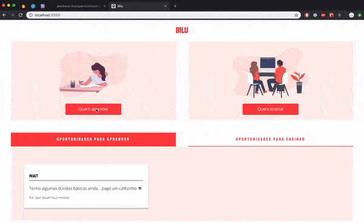

<p align="center">
  
</p>

Que você precisa sempre buscar conhecimento você já sabe mas e se esse conhecimento estivesse dentro do seu grupo/empresa e você até conhecesse essa pessoa? 🤔

O **objetivo** deste projeto é unir pessoas que querem aprender com pessoas que querem ensinar dentro da sua firma.

> Criar uma versão para usa empresa não deveria demorar mais que 10 minutos. 🕒

## Como a aplicação se parece?

<p align="center">
  
</p>

## Como criar o seu próprio Bilu

- Clone o repositório
- Crie uma conta e um projeto no [Firebase](https://firebase.google.com)

  ```
  Abra o Firebase console e crie um novo projeto.

  Na seção Banco de dados, clique em Testar Firestore Beta.

  Clique em Ativar.
  ```

- Crie um arquivo .env na raíz do projeto com o seguinte formato:

```.env
FIREBASE_API_KEY=abc
FIREBASE_AUTH_DOMAIN=abc
FIREBASE_DATABASE_URL=abc
FIREBASE_PROJECT_ID=abc
FIREBASE_STORAGE_BUCKET=abc
FIREBASE_MESSAGIN_SENDER_ID=abc
COMPANY_EMAIL_ADDRESS=coloque_aqui_o_dominio_de_email_da_sua_firma
```

- Essas informações são encontradas clicando no ícone de código na home do seu projeto no firebase (não é tão intuitivo)
- Voce precisará também configurar o método de login no firebase:

```
 Na aba Authentication clique em SIGN IN method, depois ative o método Google. Só isso :)
```

## Como desenvolver

- Clone o repositório
- `$ yarn install`
- `$ yarn dev`
- visite [http://localhost:3000](http://localhost:3000)

## Como e onde hospedar

- Você pode tentar o serviço [now.js](https://zeit.co/now) - _eu falhei, miseravelmente, tentando_
- Ou pode seguir [este](https://medium.com/@jeanbauer/como-hospedar-uma-aplica%C3%A7%C3%A3o-feita-com-next-js-no-heroku-8557421d7ed6) tutorial para fazer **de graça** no Heroku

## FAQ

- **Por que cada commit possui um emoji?** Para facilitar a leitura do git log eu utilizo emojis indicando o que cada commit se propõe de acordo com o padrão [gitmoji](https://gitmoji.carloscuesta.me/).
- **É seguro?** **Não**, não é recomendável compartilhar informações sensiveis dentro da plataforma. Se você vê como melhorar, não hesite em abrir um PR.
- **Qual é a licensa?** LGPL-3.0

```
As permissões desta licença copyleft estão condicionadas a disponibilizar o código fonte completo de trabalhos licenciados e modificações sob a mesma licença ou a GNU GPLv3.
Direitos autorais e avisos de licença devem ser preservados. Os colaboradores fornecem uma concessão expressa de direitos de patente.
```

- **O e-mail da minha empresa é @gmail mesmo, e agora?** Sugiro trocar o código que faz validação por email para uma regra que possa ser aplicada neste caso.
- **Como uma pessoa entra em contato com outra?** Manda e-mail, chama no chat da firma, conversa no corredor... iria dar muito trabalho implementar isso. :D

## Curiosidades

- Motivo das Cores: [link](https://www.fastcompany.com/90272442/bye-millennial-pink-living-coral-is-pantones-color-of-the-year)
- Combinação de fontes: [link](https://fontpair.co/)

<p align="center">
  
</p>
